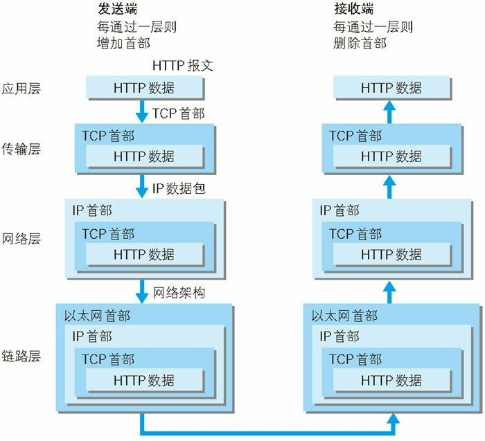
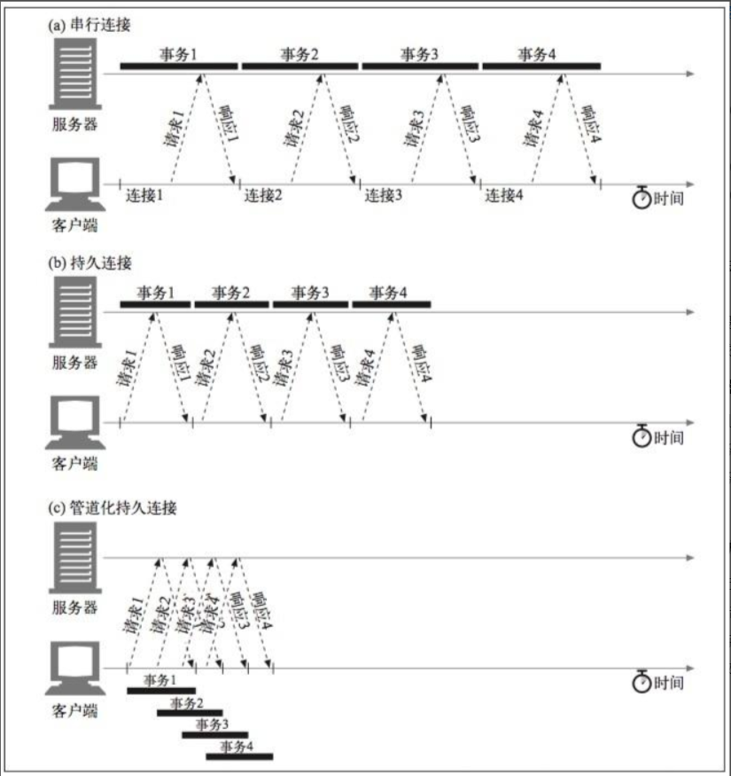
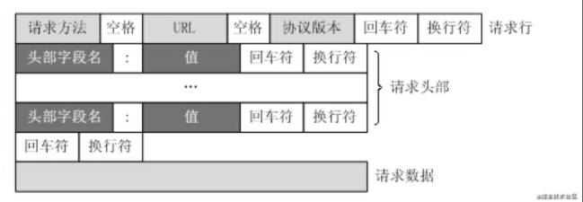
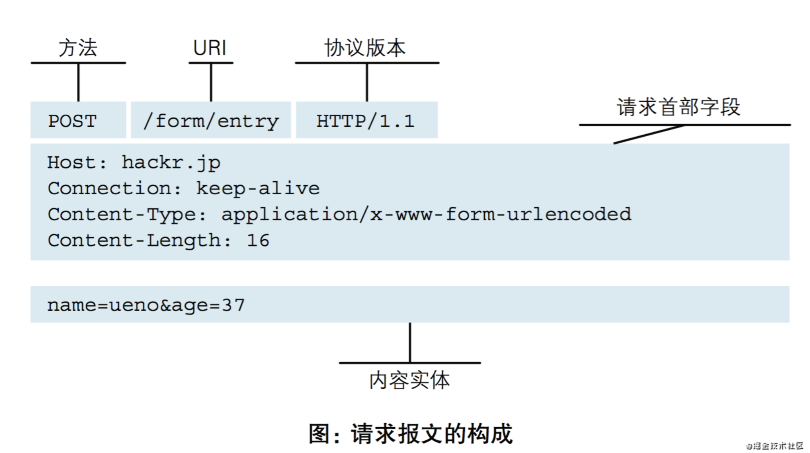
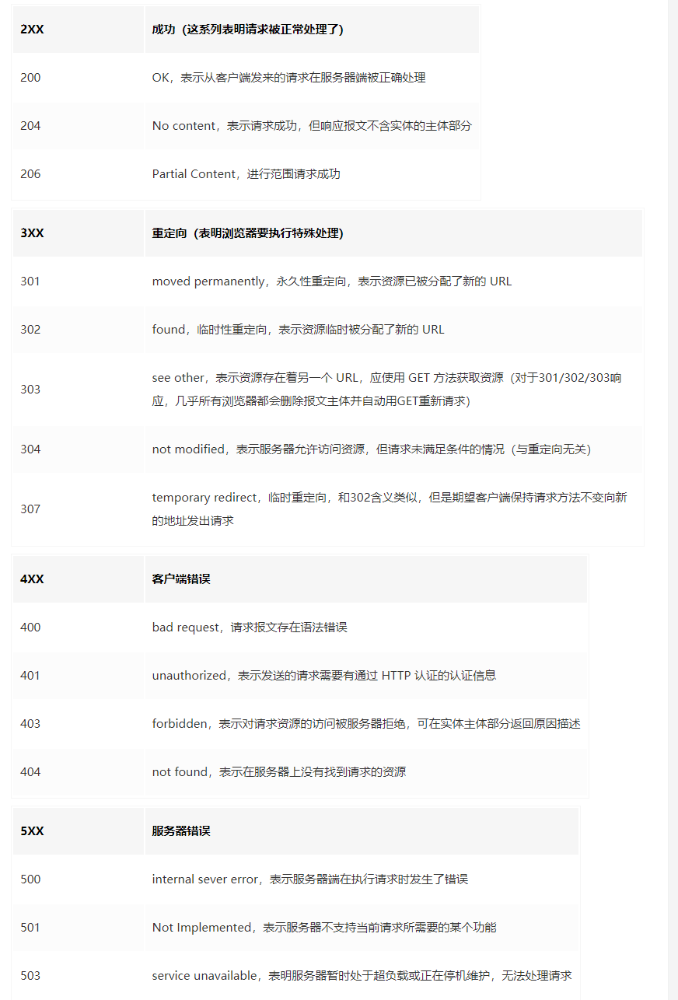
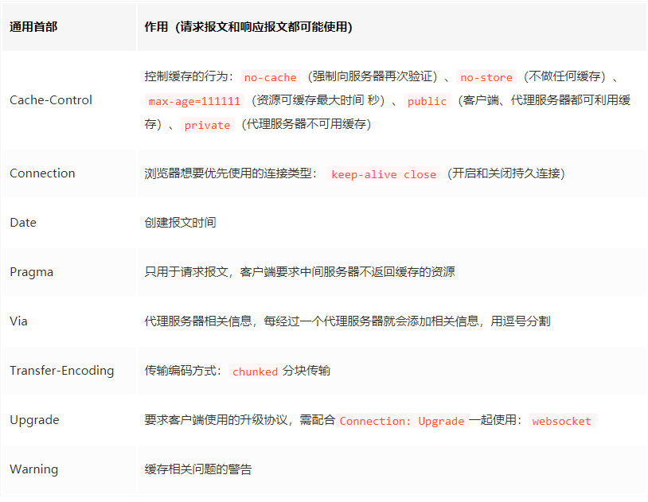
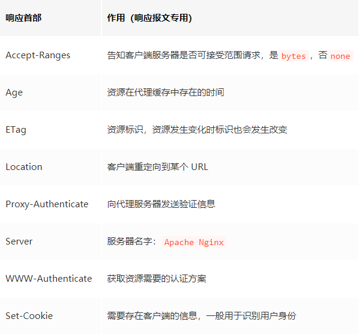
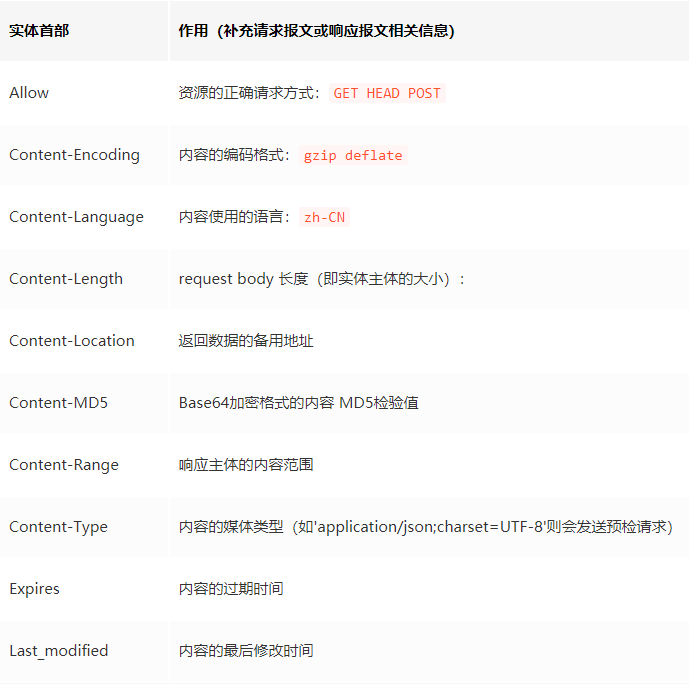
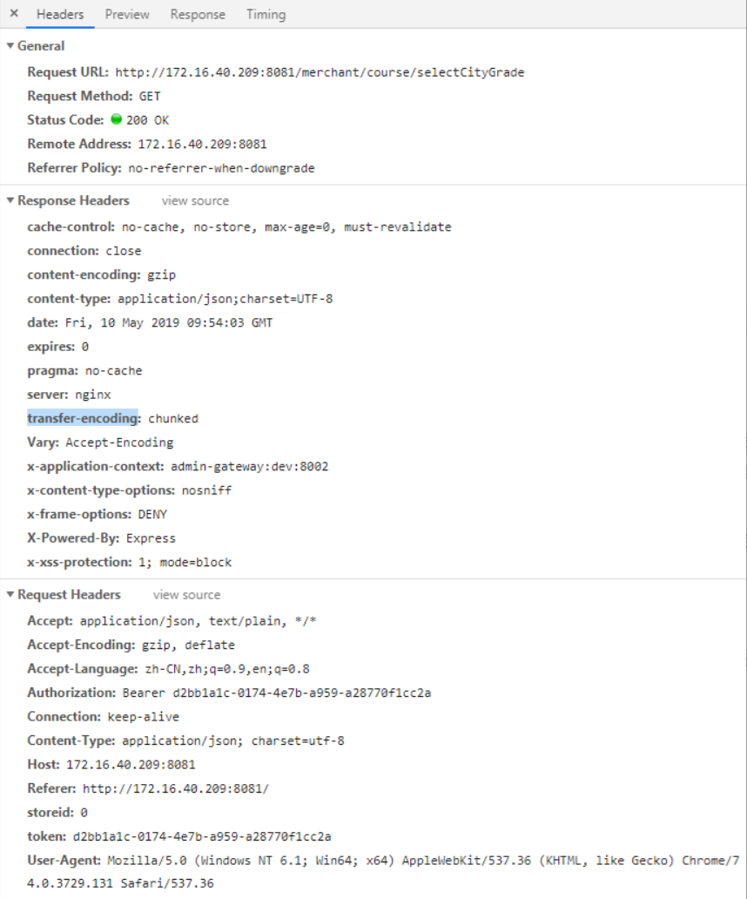
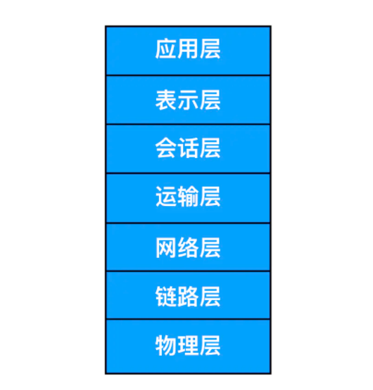

# 读懂HTTP协议，有这篇文章就够了

## 提问
### 1. 什么是 HTTPS？
答： HTTPS 是安全的 HTTP，HTTP 协议中的内容都是明文传输，HTTPS 的目的是将这些内容加密，确保信息传输安全。最后一个字母 S 指的是 SSL/TLS 协议。

### 2. 什么是信息安全传输
答：
(1) 客户端和服务器直接的通信只有自己能看懂，即使第三方拿到数据也看不懂这些信息的真实含义。  
(2) 第三方虽然看不懂数据，但可以 XJB 改，因此客户端和服务器必须有能力判断数据是否被修改过。  
(3) 客户端必须避免中间人攻击，即除了真正的服务器，任何第三方都无法冒充服务器。

### 3.如何实现信息安全传输
答： 使用对称加密
对称加密可以理解为对原始数据的可逆变换。比如 Hello 可以变换成 Ifmmp，规则就是每个字母变成它在字母表上的后一个字母，这里的秘钥就是 1，另一方拿到 Ifmmp 就可以还原成原来的信息 Hello 了。
引入对称加密后，HTTPS 的握手流程就会多了两步，用来传递对称加密的秘钥:

客户端: 你好，我需要发起一个 HTTPS 请求
服务器: 好的，你的秘钥是 1。

提到了对称加密，那么自然还有非对称加密。它的思想很简单，计算两个质数的乘积很容易，但反过来分解成两个质数的乘积就很难，要经过极为复杂的运算。非对称加密有两个秘钥，一个是公钥，一个是私钥。公钥加密的内容只有私钥可以解密，私钥加密的内容只有公钥可以解密。一般我们把服务器自己留着，不对外公布的密钥称为私钥，所有人都可以获取的称为公钥

对称密钥如何传输？  服务器直接返回明文的对称加密密钥是不是不安全。如果有监听者拿到这个密钥，不就知道客户端和服务器后续的通信内容了么？
BS: 利用非对称加密
是这样，所以不能明文传递对称秘钥，而且也不能用一个新的对称加密算法来加密原来的对称秘钥，否则新的对称秘钥同样无法传输，这就是鸡生蛋、蛋生鸡的悖论。
这里我们引入非对称加密的方式，非对称加密的特性决定了服务器用私钥加密的内容并不是真正的加密，因为公钥所有人都有，所以服务器的密文能被所有人解析。但私钥只掌握在服务器手上，这就带来了两个巨大的优势:

服务器下发的内容不可能被伪造，因为别人都没有私钥，所以无法加密。强行加密的后果是客户端用公钥无法解开。
任何人用公钥加密的内容都是绝对安全的，因为私钥只有服务器有，也就是只有真正的服务器可以看到被加密的原文。

所以传输对称秘钥的问题就迎刃而解了: 秘钥不是由服务器下发，而是由客户端生成并且主动告诉服务器。
所以当引入非对称加密后，HTTPS 的握手流程依然是两步，不过细节略有变化:

客户端: 你好，我需要发起一个 HTTPS 请求，这是我的 (用公钥加密后的) 秘钥。
服务器: 好的，我知道你的秘钥了，后续就用它传输。


说一下github配置密钥

### 4.


- 概念
HyperText Transfer Protocol 超文本传输协议
什么是超文本???
互联网早期，我们保存的信息通常都以文本即简单字符的形式存在，后面人们不满足只传输文字，比如要传输图片，音频，视频等，所以叫超文本

## http协议特点
1. 无状态协议
  双方如何认证对方？？？
  前端cookie(后端叫session)

说到http协议，不得不说TCP/IP，因为http协议是TCP/IP的子集（上层协议）

## TCP/IP协议族
如下图：



### 应用层
向用户提供应用服务时通信的协议,如FTP(文件传输),DNS(域名解析),HTTP协议

### 传输层
连接网络中两台计算机之间数据传输所使用的协议
TCP（Transmission Control Protocol，传输控制协议）和UDP（User Data Protocol，用户数据报协议
TCP发送和接收数据同步进行(例：打电话),三次握手和四次挥手
UDP协议，面向无连接，不保证有序且不丢失的传递到对方,UDP比TCP高效

### 网络层
数据传输路线（如ip协议）


### 链路层
处理网络硬件部分，包括操作系统，硬件驱动，网卡等物理传输媒介

## http协议版本
### （1）http/1.0
有点串行连接，短连接，短轮询，每次HTTP通讯后都要断开TCP连接
缺点：每个新的HTTP请求都需要建立一个新的连接（三次握手，四次挥手），极大的增加了通讯开销

### （2）http/1.1
优点：
    (1) 持久连接，减少了握手时间造成的浪费
    (2) 引入的更多的缓存策略，If-Unmodified-Since, If-Match,If-None-Match等
   （3）请求头加入Range,请求和相应必须包含Host
缺点：阻塞模式，下次请求必须等到上次响应返回后才能发起
管道化持久连接

### （3）http/2.0
优点：支持并发多个请求，服务端按照序列标识符重新排序报文。客服端接收服务端响应报文也类似
介绍：帧和流
帧代表数据传输的最小的单位，每个帧都有序列标识表明该帧属于哪个流，流也就是多个帧组成的数据流，每个流表示一个请求.
chrome扩展：HTTP/2 and SPDY indicator，可查看协议
缺点：

### Server Push
在 HTTP/2 规范中，有一节引入了一种新技术——Server Push。
解决了什么问题???
HTTP keep-alive 允许客户端和服务端用同一个 TCP 连接发送/接收多个请求/响应，减少了昂贵的 TCP 建立连接和断开连接的过程；HTTP pipelining 允许客户端在收到响应之前继续发送幂等方法（GET 和 HEAD）的请求，提升在高延迟连接下页面的加载速度；HTTP/2 更是定义了帧（frame）和流（stream），真正地复用了 TCP 连接，从而解决了 pipelining 不能解决的问题（例如「快」的响应被「慢」的响应阻塞的问题）。

简单解释： 提前推送响应
推什么和怎么推？


### websocket
WebSocket是HTML5提出的一种客户端和服务端通讯的全双工协议，由客户端发起请求，建立连接之后不仅客户端可以主动向服务端发送请求，服务端可以主动向客户端推送信息。



### http/1.x和http/2.x
http/1.x基于文本协议解析
http/2.x支持多路复用，所以改成了流的方式

### 头部压缩
http/1.x请求和响应头每次请求重复发送
http/2.x有头部压缩，通讯双发的cache保存了一份头部fields

### http/3.x
HTTP/2.0 使用了多路复用, 但当这个连接中出现了丢包的情况，那就会导致整个 TCP 都要开始等待重传（比如切换网络），也就导致了后面的所有数据都被阻塞了。
Google 基于 UDP 协议推出了一个的 QUIC 协议，并且使用在了 HTTP/3 上。新增了比如多路复用、0-RTT、使用 TLS1.3 加密、流量控制、有序交付、重传等等功能

优点：
（1）避免包阻塞（数据流相互独立互不干扰）
（2）快速重启会话（网络切换）

## HTTP报文



### 请求方法
GET/POST/PUT/DELETE/HEAD/OPTIONS

### 状态码


### 首部字段





### 浏览器常用字段


### 两种请求
1. 简单请求
  （1）请求的方法只能为HEAD、GET、POST
  （2）无自定义请求头
  （3）Content-Type只能是这几种：
    text/plain multipart/form-data application/x-www-form-urlencoded

2. 复杂请求
（1）PUT, Delete 方法的 ajax 请求
（2）发送 JSON 格式的 ajax 请求(比如post数据)
（3）带自定义头的 ajax 请求
跨域请求会先发一个预检请求

## WEB服务器
虚拟主机：HTTP/1.1强制要求携带HOST
 

### ISO（国际标准化组织）提出来计算机网络应该按照7层来组织



### 浏览器
我们在地址栏输入URL（即网址），浏览器会向DNS（域名服务器，后面会说）提供网址，由它来完成 URL 到 IP 地址的映射。然后将请求你的请求提交给具体的服务器，在由服务器返回我们要的结果（以HTML编码格式返回给浏览器），浏览器执行HTML编码，将结果显示在浏览器的正文。这就是一个浏览器发起请求和接受响应的过程。


### Web 服务器
目前最主流的三个Web服务器是Apache、 Nginx 、IIS

### WAF
WAF 是一种 Web 应用程序防护系统（Web Application Firewall，简称 WAF），它是一种通过执行一系列针对HTTP / HTTPS的安全策略来专门为Web应用提供保护的一款产品，它是应用层面的防火墙，专门检测 HTTP 流量，是防护 Web 应用的安全技术。

### DNS
域名系统

### URI / URL

### HTTP 请求响应过程

1. DNS服务器会首先进行域名的映射，找到访问www.someSchool.edu所在的地址，然后HTTP 客户端进程在 80 端口发起一个到服务器 www.someSchool.edu 的 TCP 连接（80 端口是 HTTP 的默认端口）。在客户和服务器进程中都会有一个套接字与其相连。
2. HTTP 客户端通过它的套接字向服务器发送一个 HTTP 请求报文。该报文中包含了路径 someDepartment/home.index 的资源，我们后面会详细讨论 HTTP 请求报文。
3. HTTP 服务器通过它的套接字接受该报文，进行请求的解析工作，并从其存储器(RAM 或磁盘)中检索出对象 www.someSchool.edu/someDepartment/home.index，然后把检索出来的对象进行封装，封装到 HTTP 响应报文中，并通过套接字向客户进行发送。
4. HTTP 服务器随即通知 TCP 断开 TCP 连接，实际上是需要等到客户接受完响应报文后才会断开 TCP 连接。
5. HTTP 客户端接受完响应报文后，TCP 连接会关闭。HTTP 客户端从响应中提取出报文中是一个 HTML 响应文件，并检查该 HTML 文件，然后循环检查报文中其他内部对象。
6. 检查完成后，HTTP 客户端会把对应的资源通过显示器呈现给用户。

HTTP 请求特征


## 分析异步请求


Referrer-Policy  
https://developer.mozilla.org/zh-CN/docs/Web/HTTP/Headers/Referrer-Policy


Sec-Fetch-Mode  
https://developer.mozilla.org/zh-CN/docs/Web/HTTP/Headers/Sec-Fetch-Mode


### 通过HTTP的HEADER完成各种骚操作
1. 多语言（Accept-Language）
2. 防盗链（Referer、Referered）
3. gzip（Accept-Encoding，Content-Encoding）

### 九个问题从入门到熟悉HTTPS


## 缓存设计的思路和策略
### 1.设置缓存有效期
```js
// max-age值最大为一年，有效期内浏览器直接从缓存中读取资源(无需验证)
Cache-Control: max-age=31536000

// 超过有效期(2分钟)，如果资源被更新，服务器返回完整的资源内容，否则返回304 Not Modified,告诉浏览器文件没有修改，直接取缓存
Cache-Control: max-age=120
// 如何执行这个验证呢
// 1.在服务器第一次返回给浏览器的响应http头中有个ETag字段
// 2.浏览器再次请求该资源，会添加一个名为If-None-Match的http头信息，值即是这个过期资源的Etag
```

### Cache-Control可选值
"no-cache": 不要缓存，但每一次在使用缓存之前必须（MUST）向服务器对缓存资源进行验证
"no-store"：不适用任何缓存
"must-revalidate"： 和max-age组合使用，当缓存资源小于max-age也需要验证资源

ps: 有趣的事情是，虽然no-cache意为对缓存进行验证，但是因为大家广泛的错误的把它当作no-store来使用，所以有的浏览器也就附和了这种设计。这是一个典型的劣币驱逐良币。

### 2.Expires VS. max-age
Expires 具体的过期时间  http/1.0
max-age 生命时长       http/1.1

### 3.Etag VS. Last-Modified
Last-Modified: 资源最后的更新时间。弱验证，只要资源的主要内容一致即可，允许例如页底的广告，页脚不同。
Etag： 强验证，期望资源字节级别的一致

Etag和Last-Modified同时存在，只有同时满足才能返回304状态。

### 4.


https://juejin.cn/post/6844903521272201223
https://juejin.cn/post/6844903592965439501#heading-19
https://juejin.cn/post/6844903615249776654


参考文档：  
https://juejin.cn/post/6844903844216832007  
https://zhuanlan.zhihu.com/p/26757514  
https://juejin.cn/post/6844903842773991431  


